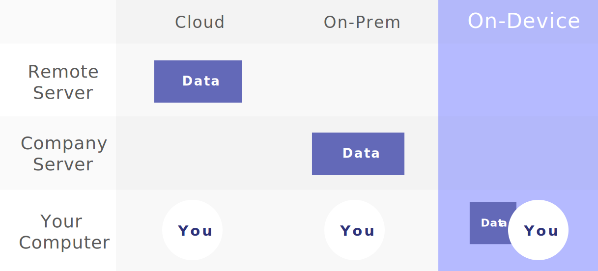
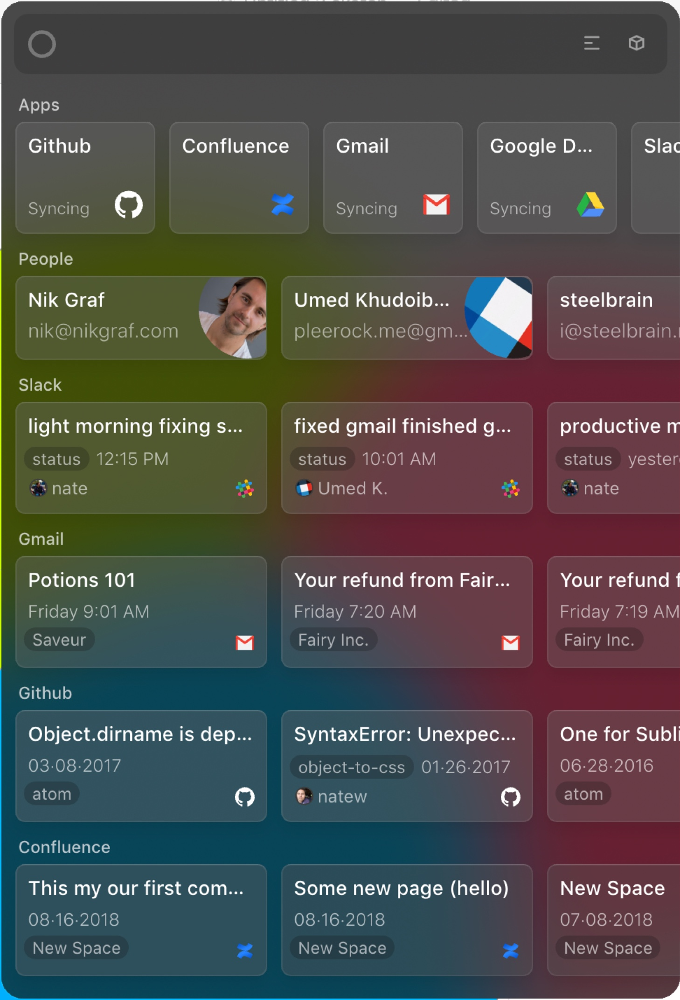
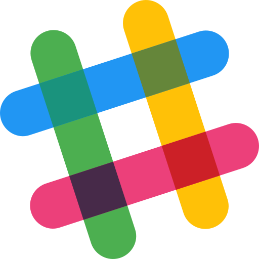

I'm certainly excited to start talking about Orbit. It's been an intense few years of development and I'm happy we can start to put it out into the world.

But first, the great news. Our alpha build is now [available for download](). While some interesting pieces are not yet in place, we pushed hard to get to where you can use it and give feedback.

So, what is Orbit? Let's start with our mission:

> To create a new [aggregation platform](https://stratechery.com/2017/defining-aggregators/) that shifts control over data back -- from companies to individuals -- to create a more flexible, powerful and inuitive knowledge interfaces.

Orbit is a new type of thing. It's a mid point between a Browser and an Operating System -- a knowledge platform that takes disparate information and makes much easier to understand, search and explore.

It's trying to change the world as it is today: a world where you have _almost no real control over your information_.

It's a bit easier to frame is like this:

Where are our Minority Report / Iron Man interfaces? Are intranets the best we can do?

> We wanted [sci-fi interfaces](https://www.youtube.com/watch?v=PJqbivkm0Ms), instead we got 100 browser tabs.

And I'm not referring to the _visual effects_ of Sci-Fi interfaces. While their interfaces are often ridiculous and impractical (how long can you keep your arms up like that?) they do get something right that we don't think about often:

**We want to be able explore information in a unified interface.**

And since the advent of the Browser, our ability to do just that has actually _regressed_. In fact before the era of web apps, Operating Systems gave use much more flexibility! All we had were files. We could often use them with different apps, and we could search and organize them and often use them cross-app.

But Operating Systems were replaced by browser tabs, and for all the good that's done, the trend has been strictly anti-Iron-Man.

I think there's room for a platform that fixes that by doing one thing: mandating apps on it sync their "data" to a common form, like a file.

I want to live in a world where:

- You can navigate all related knowledge in one interface.
- You can be confident it's complete, accurate, up to date.
- You can explore it flexibly: by people, topics, time, etc.
- You are augmented as you work: with relevant information to whatever you do.
- You can explore, correlate, build, script and extend it.
- You can do all of this without having to give up your data to 3rd parties.

Orbit will try and make that possible. Here's a quick demo of it as it stands today:

[video]

### Distribution

Orbit wants to be a _really good platform for knowledge management_, replacing clunky and stale intranet systems of today. To do that, it has to have access to basically all of your information.

Early in development we realized there's a problem trying to do that: no one wants to trust a single company with all of their data.

Duh!

We thought we'd reached a roadblock. It was hard to get anyone to install it, even as a trial. We we're stuck at distribution.

It took a lot of exploration to realize something though. Computers today are powerful with large disks, and on-device ML is feasible and effective. Orbit could run privately and entirely on your computer?

Traditional models for SaaS applications have two choices, but this would look a lot like a third choice:

1. Cloud - High security required
2. On-premise - High install cost
3. Decentralized - Harder to implement, secure and low install

This aligns perfectly with what Orbit is trying to achieve: an easy, no-risk way to give it a try. We just have to prove we could do everything on-device.

  

    
  </img>

Today, you can actually firewall Orbit so it only has access to sync data directly from your integrations.

Because you can test our Orbit without any cost, it means **the product must actually be good**. We can't hide behind a sales team. I think this solves what would have been a near-impossible distribution story for a very early stage startup, but also is a great setup to keep our company honest and focused on delivering real value rather than effective sales.

### Platform

[Skip to the end](#going-forward) if you aren't interested in feature-level details! This section goes into some of what we've built and are planning to build.

  

#### Bit

We're calling a "file" in orbit a "Bit". Where SaaS products have data behind unique interfaces and APIs, Orbit apps sync to a common fundamental unit: the bit, which can be text or HTML, for now.

#### Home

The Orbit Home is your starting point. It will aim to be the Tony Stark interface, powered by bits of information. For now it's a lot like Spotlight with some recent activity and a directory of people.

> Option+Space opens your Orbit Home

#### Language

Orbit comes with a [state of the art](https://arxiv.org/pdf/1803.08493.pdf) Natural Language engine. Importantly, it runs quickly on-device and custom to you: it's relevancy is powered by both interesting words in English as well as their relative frequency in your corpus. This powers our search, related items, and interesting word extraction.

#### Context

Context, or augmented computing, will be the first big step for Orbit to feel magical and deliver on the "future of computing" experience we want to deliver.

It's powered by a custom OCR engine we've built that focuses on one thing: being the fastest in the world. We've gotten it down to under 180ms for scanning a large and dense page of text and we have a clear path to improve! It will use <1% of your total laptop battery.

What does it mean? When writing an email, talking on Slack, browsing the Web, reading a Jira ticket, or really doing anything you do on your computer, Orbit can understand what you are looking at.

Combined with the NLP engine, it can also do _meaningful search_ to find extremely relevant items within your knowledgebase.

Or rather, _it will_. We have both the OCR and NLP working, but want to spend a few more months cooking it so it is actually useful. Luckily we found an amazing developer who has joined us to specifically to help with this, and it's exciting to see it start to become stable.

I wanted to mention it now, though, becuase it's relevant to this next section.

#### Apps

Some beautiful apps come out of the box: Gmail, Google Docs, Github, Slack, Jira, and Confluence. We plan to add some more flexible ones as well soon including generic Web and API apps.

  
  
  
  
  
  

But Apps can be much more powerful and diverse than I think we can ever predict, especially given the incredible stochasticity of information and it's needs. So while I don't think we can build one solution for everyone, I do think we can provide a powerful set of APIs that enable building those experiences.

So we want to put the right building blocks in place, and begin testing our own App Store early next year. The blocks will include the Language and Context engines, some augmented features, as well as our mature UI Kit. There's much more to come here.

### Going forward

There's a lot more I'd like to write, but I think is more than enough to start.

I'll end with something that will risk sounding cliché:

I think the biggest feature of Orbit is trust. Orbit won't succeed if it tries to be a traditional startup. If you don't feel it will respect your privacy in the long run, we've lost. Orbit will need to be thought of like a Browser or Operating System: a fundamental tool you trust to handle sensitive information.

We've designed it in the only I know to guarantee that: by never sending data off your device. Of course, trust doesn't matters if you don't have a great product that meets real needs. The next feed months will be exciting as we attempt to do just that. And your feedback will be the most important part of ensuring that!

[Here is my email](nate@tryorbit.com). Please send me any and all inquiries, requests and bugs.

[Here is our roadmap](). We will update it about once a week.

I am very excited to start sharing progress with you all.

 
