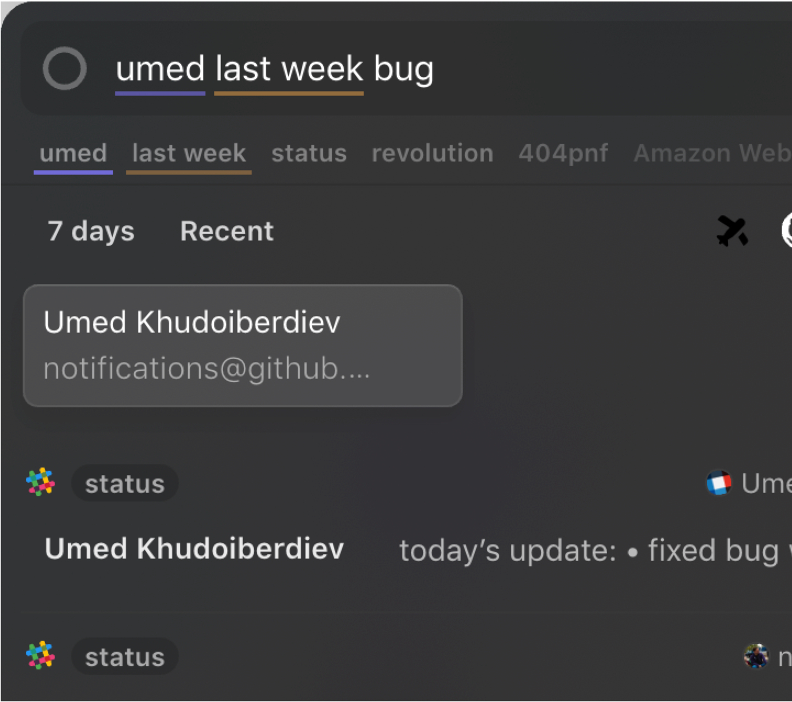

_Note: this is for early insiders, please don't share the link. I'll go into some more detailed product and distribution plans._

I'm really excited to start talking about Orbit. It's been under intense development, so it feels great to get it out to the world. We're starting today to send alpha builds to [mailing list subscribers](https://tryorbit.com). Please do sign up and I'll send it your way!

---

I'd like to introduce Orbit. Let's start with a story:

You read, write, email, chat, document, ticket... from Slack to Jira to GDocs to Github. Your knowledge is distributed across many services and your wiki or portal don't keep up -- they're another source of truth, a cumbersome point of interaction, and more infrastructure to maintain.

There's a trend in the world, and it's preventing us from staying on top of information flowing through our companies and digital lives. Before going into detail, I think it's actually best explained by the gap between the sci-fi interfaces we dream of in film and TV, and the reality of how we work today.

> We wanted [sci-fi interfaces](https://www.youtube.com/watch?v=PJqbivkm0Ms), instead we got 100 browser tabs.

  Ergonomically though, we can do better.

The visual effects of Iron Man and Minority Report may be frivolous, but these interfaces do grasp at a real and unmet desire: for unification, fluidity, and control over our information.

The web today has become a world of silos. Browsers are silo-explorers, and tabs are their moat. We want to fix this, but to do so we'll have break out of the tab. Where we have _files_ in operating systems, which give us portability, the web has no equivalent. Futher, even when we can export data from a web service, there's no interface to put it to use.

So, Orbit's mission:

> To create an [aggregation platform](https://stratechery.com/2017/defining-aggregators/) for information, so we can control and understand our data flexibly and intuitively.

I think of Orbit as the answer to the desire we ran into time and again in user research. It can be summarized as:

<b>"I want to understand/organize my knowledgebase, and can't."</b>

## A new deal

Orbit is ultimately a play to give us much more control over our data. To do so it's designed as decentralized platform: think of it as an operating system rather than a service. This distinction is important. Instead of storing data or adding a source of truth, Orbit just manages existing information (a lot like browsers and OS's do).

Operating systems gave us a lot of control, via _files_. [In some forms](https://www.salon.com/2017/09/03/remember-palms-webos-maybe-not-but-apple-and-google-definitely-do/) they even had beautiful cross-cloud unified contacts, calendars and messages. Browsers gave us the ability to explore widely, but lost a lot of the control we had in files.

Orbit wants to tilt us back to being able to manage, understand, and organize information. It aims to let you:

- Navigate disparate knowledge quickly and easily.
- Search intuitively by person, topic, time.
- Augment yourself with relevant information as you normally work.
- Build, extend and use apps on top of it with ease.
- Do all of this without giving up privacy or security.

  A Topic Explorer for Github app, opened in Orbit

### Distribution: From Roadblock to Selling Point

To replace stale and clunky intranets of today, Orbit will need to crawl a lot of your sensitive information. But that creates a tension: _no one wants any one company to handle 100% of their data_. It's a misaligned incentive we ran into early in user research. Even close friends at relatively fast-and-loose startups were hesitant to install it!

We wanted to focus on building a better knowledge tool, but it was clear having Orbit in the cloud or on-prem would force us to build a good sales team rather than focus on an already-difficult-enough product.

The solution we eventually came to allows us to undo this tension. It was a realization: today's computers are powerful and NLP orders of magnitude faster/easier than years ago. If we could do it all on your device, we'd be able to give users complete privacy and avoid any on-premise install.

  

    
  </img>

Today, Orbit realizes this strategy. It runs, syncs, searches -- does everything -- privately on your computer. We still need to finish some of the team-level syncing, but we have our guarantee in place: we'll never handle your data outside your computer. You can even firewall Orbit just to be safe.

### The Features

For now Orbit is a lot like Spotlight, with a Home. The Home shows recent activity, people, and apps you've installed.

Orbit will grow to become more akin to a knowledge assistant. It will get better at understanding english queries, sorting staleness, augmenting as you work, and summarizing noisy data. It will also become more contextually aware, which I explain a bit more in the Context section.

  

#### Bit

We're calling a file in orbit a _Bit_. Where your OS has files and apps, and SaaS products have a plethora of unique interfaces and APIs, Orbit has bits and apps which give us a consistent interface. A bit can represent Text, HTML, Tasks, Conversations, Documents, and more.

#### Language

Orbit comes with a [state of the art](https://arxiv.org/pdf/1803.08493.pdf) natural language engine. Importantly, it runs quickly on-device and is custom to your knowledge: it's relevancy is powered by the meaning of words in English and their frequency in your corpus.

  Cosal showing relative word interestingness in realtime.

#### Context

Context will be the first big step Orbit makes to deliver on the "future of computing" promise. Powered by a novel OCR engine that focuses on one thing: being fast. We're close to having it to use <1% of your laptop battery.

Why an OCR engine? It means no matter if you're writing an email in Mail.app, talking on Slack, browsing the Web, or doing anything on your computer, Orbit understands what you are looking at, down to the lines you write.

  

Combined with the Language engine, it means Orbit can do _meaningful search_ to find extremely relevant items within your knowledgebase based on whatever you're doing. But that's just the start. Context is not yet available in Orbit, but it's close.

#### People

People are a first class concept in Orbit. Using the aggregated information from the apps you plug in and the Language topic modeling, we show topics people are experts in, alongside recent activity.

#### Apps

With all of these pieces together we have apps. Some apps we've built out of the box: Gmail, Google Docs, Github, Slack, Jira, and Confluence. We'll be adding more flexible ones next like Web and API crawlers.

  
  
  
  
  
  

#### App Store

We can't predict what apps and views will be most useful for any one person or company, though. As we finish each of the above mentioned parts, along with our interface kit, we're going to release an App Store later this year.

Apps will have full access to the People, Language and Context APIs, our UI Kit, and importantly, a built in live-editing environment that lets you go from code to deploy in one-click -- with no infrastructure required.

If you're interested in building apps on top of Orbit, get in touch with me below. I'll set up a Slack room where we can play with early builds and build cool apps together.

### Join our Orbit

There's a lot more I'll write in the coming months. Keep in mind the builds today are early. There are interesting parts not quite ready yet, but almost there. I think the next few months will see some really rapid iteration and I'd love your feedback, as much as possible, to keep us on the right path.

Our [roadmap](/roadmap) and [mailing list](https://tryorbit.com).

  <a href="mailto:nate@tryorbit.com">My email</a>, send any inquiries, requests, issues.

[Join our Slack room](http://slack.tryorbit.com) if you'd like to discuss more or give detailed feedback.

 
