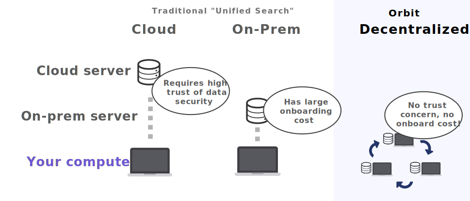

I'm certainly excited to start talking about Orbit. It's been an intense few years of development and I'm happy we can start to put it out into the world.

But first, the great news. Our alpha build is now [available for download](). While some interesting pieces are not yet in place, we pushed hard to get to where you can use it and give feedback.

So, what's Orbit? Let's start with our mission:

> To create a new [aggregation platform](https://stratechery.com/2017/defining-aggregators/) that gives individuals control over siloed web data to create a more flexible, powerful and inuitive knowledge exploration.

Orbit is a new type of thing. It's a mid point between a Browser and an Operating System -- a knowledge platform that takes disparate information and makes much easier to understand, search and explore.

We see a trend in the world where the rise of cloud computing has left us with _almost no real control over our information_. You can frame is like this:

What's preventing me from exploring my company like Iron Man?

> We wanted [sci-fi interfaces](https://www.youtube.com/watch?v=PJqbivkm0Ms), instead we got 100 browser tabs.

I'm not referring to the _visual effects_ of the movie. While those are ridiculous (how long can you keep your arms up like that?) what Iron Man and basically every Sci Fi movie ever does get right is something that we accidentaly kept running into in user research:

**I want to be able to explore information in a unified interface.**

From Slack noise to Jira lag to the black hole of a team Google Drive -- we love these services for what they're designed to do -- but when we're going about our day, they are never at hand.

The transition to from the OS era to the Browser era has been almost exclusively anti-Iron Man. In 1999 all we used were files, and while collaboration was hard, almost everything else was better: organization, search, and data portability.

We'd like a world where:

- You can navigate important knowledge quickly and easily.
- You can be confident it's holistic, accurate, up to date.
- You can slice it in natural ways: by person, topic, and time.
- You don't have to think about it: it augments you in context as you work.
- You can easily manage it, extend it, and build apps on top of it.
- You can do all of this without having to give up your data to a 3rd party.
- You can do all of this without the whole thing becoming a mess.

Orbit's goal is make this real. Here's a demo:

[video]

### Our Secret: Distribution

Orbit wants to be a _really good platform for knowledge management_, replacing clunky and stale intranet and portal systems of today. To do that, it is most helpful if it crawls all of your company information. But early in development we realized there's a problem trying to do that: no one wants to trust a single company with _everything_.

Duh!

We thought we'd reached a roadblock. Huge enterprise sales cycles didn't excite us and they weren't the problem we felt was necessary to solve. But it was impossible to get anyone to install it. We we're stuck at distribution.

Until we had a realization: computers today are powerful. They have large disks, and NLP algorithms have become as fast as multiplication with just a few MBs of space.

That meant Orbit could run _entirely privately on your computer_. We'd just have to figure out a way to have it sync data between peers, basically adding a third pillar to traditional enteprise app models:

1. **Cloud** - High trust of security required, easy to develop.
2. **On-premise** - Secure, high install cost, large sales cycle, harder to develop.
3. **Decentralized** - Secure, low install cost, limited compute and harder to develop.

But given the advances in NLP and compute power, it immediately became clear this got rid of our big distribution problem: it aligned our incentives with our users.

  

    
  </img>

So you can try Orbit at no cost: no security risk, no time talking to sales, and no complex install. Just download the app. Which means **the product must actually be good**. It's the alignment we love as product developers, and solves what was a near-impossible distribution story for an early stage startup.

### The details

[Skip to the end](#going-forward) if you aren't interested in feature-level details! This section goes into some of what we've built and are planning to build.

  

#### Bit

We're calling a "file" in orbit a "Bit". Where SaaS products have data behind unique interfaces and APIs, Orbit apps sync to a common fundamental unit: the bit, which can be text or HTML, for now.

#### Home

The Orbit Home is your starting point. It will aim to be the Tony Stark interface, powered by bits of information. For now it's a lot like Spotlight with some recent activity and a directory of people.

> Option+Space opens your Orbit Home

#### Language

Orbit comes with a [state of the art](https://arxiv.org/pdf/1803.08493.pdf) Natural Language engine. Importantly, it runs quickly on-device and custom to you: it's relevancy is powered by both interesting words in English as well as their relative frequency in your corpus. This powers our search, related items, and interesting word extraction.

#### Context

Context, or augmented computing, will be the first big step for Orbit to feel magical and deliver on the "future of computing" experience we want to deliver.

It's powered by a custom OCR engine we've built that focuses on one thing: being the fastest in the world. We've gotten it down to under 180ms for scanning a large and dense page of text and we have a clear path to improve! It will use <1% of your total laptop battery.

What does it mean? When writing an email, talking on Slack, browsing the Web, reading a Jira ticket, or really doing anything you do on your computer, Orbit can understand what you are looking at.

Combined with the NLP engine, it can also do _meaningful search_ to find extremely relevant items within your knowledgebase.

Or rather, _it will_. We have both the OCR and NLP working, but want to spend a few more months cooking it so it is actually useful. Luckily we found an amazing developer who has joined us to specifically to help with this, and it's exciting to see it start to become stable.

I wanted to mention it now, though, becuase it's relevant to this next section.

#### Apps

Some beautiful apps come out of the box: Gmail, Google Docs, Github, Slack, Jira, and Confluence. We plan to add some more flexible ones as well soon including generic Web and API apps.

  
  
  
  
  
  

But Apps can be much more powerful and diverse than I think we can ever predict, especially given the incredible stochasticity of information and it's needs. So while I don't think we can build one solution for everyone, I do think we can provide a powerful set of APIs that enable building those experiences.

So we want to put the right building blocks in place, and begin testing our own App Store early next year. The blocks will include the Language and Context engines, some augmented features, as well as our mature UI Kit. There's much more to come here.

### Going forward

There's a lot more I'd like to write, but I think is more than enough to start.

I'll end with something that will risk sounding cliché:

I think the biggest feature of Orbit is trust. Orbit won't succeed if it tries to be a traditional startup. If you don't feel it will respect your privacy in the long run, we've lost. Orbit will need to be thought of like a Browser or Operating System: a fundamental tool you trust to handle sensitive information.

We've designed it in the only I know to guarantee that: by never sending data off your device. Of course, trust doesn't matters if you don't have a great product that meets real needs. The next feed months will be exciting as we attempt to do just that. And your feedback will be the most important part of ensuring that!

[Here is my email](nate@tryorbit.com). Please send me any and all inquiries, requests and bugs.

[Here is our roadmap](). We will update it about once a week.

I am very excited to start sharing progress with you all.

 
